 
<h3 align="center">📊 MY GITHUB DEPLOYMENT DASHBOARD</h3>
 

<table width="100%">
  <tr>
    <!-- ================= LEFT COLUMN ================= -->
    <td width="50%" valign="top">
      <!-- Core Profile Stats Card & Coding Activity Charts -->
      
        
      <!-- Tech Icon Stack Grid -->
      
    </td>
    
    <!-- ================= RIGHT COLUMN ================= -->
    <td width="50%" valign="top">
      <!-- Web Performance & 3D Contribution Graph -->
      
        
      <!-- Audio Tracks, Language Breakdown & Project Roadmaps -->
      
    </td>
  </tr>
</table>

 
