# 🎮 Talal Ali
### Software Engineer | Game Systems & AI Architecture

> Specializing in Performance Optimization, Real-Time Systems, and Intelligent Relational Databases.

---

### 🌐 Connect With Me

  
  
  

---

## 🤷‍♂️ TL;DR — Who Am I?

* 🎓 **FAST '24K CS Student**
* 🎮 **Passionate about Game Dev & Systems Architecture**
* ⚡ **Writing optimized, low-level code**

* ☕ Driven by caffeine, curiosity, and the satisfaction of watching a complex loop run slightly faster than it did yesterday.
* 🎮 A game engineer at heart who looks at a video game and immediately wonders, *"How are they handling player interpolation on that server?"*
* 🧠 I genuinely enjoy the logic behind constraint solvers and relational databases — meaning I'm probably one of the few people who finds writing raw SQL queries relaxing.
* 🚀 Strong believer that clean, documented code and hyper-optimized execution don't have to be mutually exclusive.

---

## 🖥️ MY GITHUB DEPLOYMENT DASHBOARD

<!-- This block pulls your standalone, full-bleed metrics image seamlessly -->

  

---

<i>Automated updates deployed daily via GitHub Actions</i>

